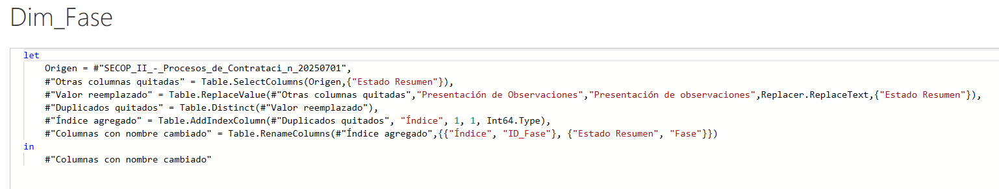
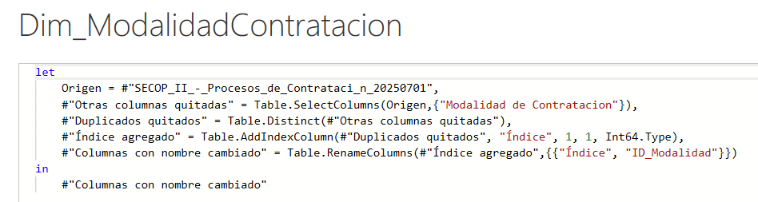

# Procesos de compra hechos en la plataforma SECOP II - Enero a Junio del 2025

## Descripción general

Este proyecto analiza los procesos de compra pública realizados en la plataforma SECOP II durante el primer semestre de 2025, estén o no adjudicados. El objetivo es explorar, modelar y visualizar la información para obtener insights relevantes sobre la contratación estatal en Colombia.

*SECOP II, creado por la Ley 1150 de 2007, es el punto único de ingreso de información y generación de reportes para entidades estatales y la ciudadanía en materia de compra y contratación pública. Los datos son actualizados diariamente por Colombia Compra Eficiente y publicados en el portal de Datos Abiertos.*

---

## Herramientas utilizadas

- Power BI Desktop
- Power BI Services

---

## Información del conjunto de datos

- **Fuente:** [Datos Abiertos Colombia – SECOP II](https://www.datos.gov.co/Gastos-Gubernamentales/SECOP-II-Procesos-de-Contrataci-n/p6dx-8zbt/about_data)
- **Nombre:** SECOP II - Procesos de Contratación
- **Categoría:** Gastos Gubernamentales
- **Descripción:** Registro de los procesos de compra, sean o no adjudicados, hechos en la plataforma SECOP II  desde su lanzamiento
- **Fecha de actualización:** 1 de julio de 2025
- **Datos suministrados por:** Colombia Compra Eficiente
- **Propietario:** Colombia Compra Eficiente (Datos Abiertos CCE)
- **Filtrado aplicado:** Solo procesos publicados entre el 01 de enero y el 30 de junio de 2025
- **Filas analizadas:** 1.014.863 donde cada fila es un proceso
- **Columnas que se utilizarán para el análisis:** 22
- **Columnas originales:** 59

| Nombre de la columna                  | Descripción                                                                 | Nombre del campo API                 | Tipo de Dato                |
|---------------------------------------|-----------------------------------------------------------------------------|--------------------------------------|-----------------------------|
| Entidad                              | Nombre de la Entidad que publica el proceso de compra pública               | entidad                              | Texto                       |
| Nit Entidad                          | NIT de la Entidad que publicó el proceso                                    | nit_entidad                          | Texto                       |
| Departamento Entidad                  | Departamento en el cual está registrada la entidad                          | departamento_entidad                 | Texto                       |
| Ciudad Entidad                        | Ciudad en la cual está registrada la entidad                                | ciudad_entidad                       | Texto                       |
| OrdenEntidad                          | Orden de la Entidad (Nacional, Regional)                                    | ordenentidad                         | Texto                       |
| Entidad Centralizada                  | Identifica si la entidad es o no centralizada                               | codigo_pci                           | Texto                       |
| ID del Proceso                        | Identificador Único del Proceso, valor generado por la plataforma           | id_del_proceso                       | Texto                       |
| Referencia del Proceso                | Identificador del Proceso, valor generado por la Entidad                    | referencia_del_proceso               | Texto                       |
| PCI                                   | Código de Unidad - Sub Unidad Contratación                                  | ppi                                  | Texto                       |
| ID del Portafolio                     | Identificador del Portafolio al cual corresponde el proceso de compra       | id_del_portafolio                    | Texto                       |
| Nombre del Procedimiento              | Nombre dado al proceso de compra por la Entidad                             | nombre_del_procedimiento             | Texto                       |
| Descripción del Procedimiento         | Primera definición de las características principales del proceso           | descripci_n_del_procedimiento        | Texto                       |
| Fase                                  | Fase en la que actualmente se encuentra el proceso                          | fase                                 | Texto                       |
| Fecha de Publicacion del Proceso      | Fecha de la publicación inicial del proceso de compra                       | fecha_de_publicacion_del             | Marca de tiempo variable    |
| Fecha de Ultima Publicación           | Fecha de la última publicación hecha para el proceso de compra              | fecha_de_ultima_publicaci            | Marca de tiempo variable    |
| Fecha de Publicacion (Fase Planeacion Precalificacion) | Fecha de publicación de la fase de Planeación en Precalificación | fecha_de_publicacion_fase             | Marca de tiempo variable    |
| Fecha de Publicacion (Fase Seleccion Precalificacion) | Fecha de publicación de la fase de Selección en Precalificación | fecha_de_publicacion_fase_1           | Marca de tiempo variable    |
| Fecha de Publicacion (Manifestacion de Interes) | Fecha de publicación de la fase de Manifestación de Interés         | fecha_de_publicacion                  | Marca de tiempo variable    |
| Fecha de Publicacion (Fase Borrador)  | Fecha de publicación de la fase Borrador                                    | fecha_de_publicacion_fase_2           | Marca de tiempo variable    |
| Fecha de Publicacion (Fase Seleccion) | Fecha de publicación de la fase Selección                                   | fecha_de_publicacion_fase_3           | Marca de tiempo variable    |
| Precio Base                           | Precio Base, proyectado, del proceso de Compra                              | precio_base                           | Número                      |
| Modalidad de Contratacion             | Modalidad de selección bajo la cual se desarrolla el proceso de Compra      | modalidad_de_contratacion             | Texto                       |
| Justificación Modalidad de Contratación | Justificación para la modalidad de selección elegida                       | justificaci_n_modalidad_de            | Texto                       |
| Duracion                              | Valor de la Duración estimada del proceso de compra pública                 | duracion                              | Número                      |
| Unidad de Duracion                    | Unidad que aplica a la Duración estimada del proceso de compra pública      | unidad_de_duracion                    | Texto                       |
| Fecha de Recepcion de Respuestas      | Fecha asignada para la recepción de respuestas                              | fecha_de_recepcion_de                 | Marca de tiempo variable    |
| Fecha de Apertura de Respuesta        | Fecha Estimada para la Apertura de las respuestas                           | fecha_de_apertura_de_respuesta        | Marca de tiempo variable    |
| Fecha de Apertura Efectiva            | Fecha Real para la Apertura de las respuestas                               | fecha_de_apertura_efectiva            | Marca de tiempo variable    |
| Ciudad de la Unidad de Contratación   | Ciudad de la unidad de contratación de la Entidad                           | ciudad_de_la_unidad_de                | Texto                       |
| Nombre de la Unidad de Contratación   | Nombre de la unidad de contratación de la Entidad                           | nombre_de_la_unidad_de                | Texto                       |
| Proveedores Invitados                 | Número de Proveedores invitados a participar del proceso                    | proveedores_invitados                 | Número                      |
| Proveedores con Invitacion Directa    | Proveedores con Invitación a participar hecha de forma directa              | proveedores_con_invitacion            | Número                      |
| Visualizaciones del Procedimiento     | Número de Visualizaciones del Proceso de Compra                             | visualizaciones_del                   | Número                      |
| Proveedores que Manifestaron Interes  | Proveedores que Manifestaron Interés en el proceso                          | proveedores_que_manifestaron          | Número                      |
| Respuestas al Procedimiento           | Respuestas hechas al procedimiento                                          | respuestas_al_procedimiento           | Número                      |
| Respuestas Externas                   | Número de Respuestas hechas por entes externos                              | respuestas_externas                   | Número                      |
| Conteo de Respuestas a Ofertas        | Número de Respuestas hechas de forma directa en las ofertas                 | conteo_de_respuestas_a_ofertas        | Número                      |
| Proveedores Unicos con Respuestas     | Proveedores Únicos que han redactado respuestas en el proceso               | proveedores_unicos_con                | Número                      |
| Numero de Lotes                       | Número de lotes de artículos solicitados dentro del proceso                 | numero_de_lotes                       | Número                      |
| Estado del Procedimiento              | Estado actual de desarrollo del procedimiento de compra pública             | estado_del_procedimiento              | Texto                       |
| ID Estado del Procedimiento           | Identificador del Estado del procedimiento                                  | id_estado_del_procedimiento           | Número                      |
| Adjudicado                            | Determina si el proceso fue adjudicado                                      | adjudicado                            | Texto                       |
| ID Adjudicacion                       | Identificador de la adjudicación                                            | id_adjudicacion                       | Texto                       |
| CodigoProveedor                       | Código del proveedor adjudicado                                             | codigoproveedor                       | Texto                       |
| Departamento Proveedor                | Departamento del proveedor adjudicado                                       | departamento_proveedor                | Texto                       |
| Ciudad Proveedor                      | Ciudad del proveedor adjudicado                                             | ciudad_proveedor                      | Texto                       |
| Fecha Adjudicacion                    | Fecha de adjudicación para el proveedor seleccionado                        | fecha_adjudicacion                    | Marca de tiempo variable    |
| Valor Total Adjudicacion              | Valor total adjudicado                                                      | valor_total_adjudicacion              | Número                      |
| Nombre del Adjudicador                | Nombre del Usuario que ejecutó la adjudicación                              | nombre_del_adjudicador                | Texto                       |
| Nombre del Proveedor Adjudicado       | Nombre del Proveedor Adjudicado                                             | nombre_del_proveedor                  | Texto                       |
| NIT del Proveedor Adjudicado          | NIT del Proveedor Adjudicado                                                | nit_del_proveedor_adjudicado          | Texto                       |
| Codigo Principal de Categoria         | Código UNSPSC de la categoría principal del producto o servicio             | codigo_principal_de_categoria         | Texto                       |
| Estado de Apertura del Proceso        | Estado de Apertura de información del proceso                               | estado_de_apertura_del_proceso        | Texto                       |
| Tipo de Contrato                      | Tipo de Contrato definido para el proceso de compra                         | tipo_de_contrato                      | Texto                       |
| Subtipo de Contrato                   | Subtipo de Contrato definido para el proceso de compra                      | subtipo_de_contrato                   | Texto                       |
| Categorias Adicionales                | Categorías UNSPSC adicionales incluidas en el proceso                       | categorias_adicionales                | Texto                       |
| URLProceso                            | URL para consultar el proceso de compra                                     | urlproceso                            | URL                         |
| Codigo Entidad                        | Código de la entidad en la plataforma SECOPII                               | codigo_entidad                        | Número                      |
| Estado Resumen                        | Resumen del estado del proceso de compra pública                            | estado_resumen                        | Texto                       |

---

# Análisis exploratorio de datos

## Selección de datos

- Se exploran las 59 columnas originales y se seleccionan 22 relevantes para el análisis.
- Las 37 columnas restantes se eliminan por ser irrelevantes, incompletas o redundantes.

**Columnas seleccionadas:**
- Entidad
- Departamento Entidad
- Ciudad Entidad
- OrdenEntidad
- Entidad Centralizada
- ID del Proceso
- PCI
- Fecha de Publicación del Proceso
- Modalidad de Contratación
- Nombre de la Unidad de Contratación
- Estado del Procedimiento
- Adjudicado
- ID Adjudicación
- Código Proveedor
- Departamento Proveedor
- Ciudad Proveedor
- Valor Total Adjudicación
- Nombre del Proveedor Adjudicado
- Código Principal de Categoría
- Estado de Apertura del Proceso
- Tipo de Contrato
- Estado Resumen

## Validación de tipos de datos

- Se identifican y corrigen problemas de formato regional.

| Columna                        | Tipo de dato    | Configuración regional         |
|--------------------------------|-----------------|-------------------------------|
| Valor Total Adjudicación       | Número entero   | Inglés (Estados Unidos)        |
| Fecha de Publicación del Proceso | Fecha         | Inglés (Estados Unidos)        |

  
- Se ajusta tipo de datos

| Columna | Tipo de dato | Cambio         |
|---------|--------------|----------------|
| PCI     | Texto        | Número Entero  |

---

## Diseño del modelo de datos

- Se define un modelo estrella con una tabla de hechos de los procesos y 10 tablas de dimensiones (Entidad, Proveedor, Adjudicado,Estado Apertura, Estado procedimiento, Fase, Modelidad de contratación, Tipo Contrato, Segmento y fecha.
- Se crean claves primarias y foráneas, incluidas claves sustitutas generadas manualmente cuando no existen en el origen.

---

# Proceso de ETL (Extracción, Transformación y Carga)

## 1. Carga inicial

- Se importa el dataset original a Power Query.
- Se eliminan columnas innecesarias y se inhabilita la carga de la tabla base en el modelo.

  

## 2. Creación de tablas de dimensiones

Para cada dimensión:
- Crear tabla de referencia desde la tabla principal.
- Seleccionar la columna relevante y quitar el resto.
- Generar perfiles según el dataset completo.
- Quitar duplicados.
- Crear clave primaria (índice si aplica).
- Renombrar  Columnas
- Ajustar tipos de datos.
- Limpiar caracteres especiales y espacios.

## 3. Creación de la tabla de hechos

- Se crea por referencia desde la tabla principal.
- Incluye solo: ID del Proceso, Fecha de Publicación, ID Adjudicación, Valor Total Adjudicación y claves foráneas.
- Se realizan combinaciones externas izquierdas (merge) con cada dimensión para traer las claves.
- Se crea una columna personalizada para el ID de segmento (primeros dos dígitos del código de categoría principal).
- Se eliminan columnas innecesarias
- se ajustan tipos de datos.

## 4. Dimensión segmento
*The United Nations Standard Products and Services Code® - UNSPSC - Código Estándar de Productos y Servicios de Naciones Unidas, es una metodología uniforme de codificación utilizada para clasificar productos y servicios fundamentada en un arreglo jerárquico y en una estructura lógica. Este sistema de clasificación permite codificar productos y servicios de forma clara ya que se basa en estándares acordados por la industria los cuales facilitan el comercio entre empresas y gobierno.*

- Se añade un nuevo origen de datos: lista de códigos UNSPSC.
- Crear Tabla de Referencia a la tabla de hechos y se crea la dimensión segmento a partir del ID de segmento extraído
- Se asocia el nombre del segmento desde el archivo UNSPSC mediante combinacion externa izquierdas (merge)
- Se eliminan duplicados
- Se inhabilita la carga del archivo UNSPSC en el modelo.

## Resultado Final

## 5. Tabla de fechas

- Se crea mediante DAX (`CALENDAR`) con el rango 01/01/2025 a 30/06/2025.
- Se añaden columnas de año, número de mes, día y nombre de mes.
- Se deshabilita la fecha y hora automáticas y se marca como tabla de fechas.
- Se ordena la columna de mes por el número de mes.

---

# Modelado de datos

- Se establecen relaciones varios a uno entre la tabla de hechos y cada dimensión.
- Se anclan campos relacionados en la parte superior de las tarjetas.
- Se ocultan columnas de clave en el modelo para simplificar la vista.

---

## Medidas creadas

- **Procesos Adjudicados:** Indica el numero de procesos adjudicados o cero si no hay ninguno. 
  `Procesos Adjudicados = COALESCE(CALCULATE(COUNTROWS('Hechos_Procesos'), 'Hechos_Procesos'[ID_Adjudicado] = 1),0)`
- **Procesos de Compra:** Indica el numero de procesos totales. 
  `Procesos de Compra = COUNTROWS('Hechos_Procesos')`
- **Tasa de Adjudicación:** Muestra el % de adjudicación o cero si no hay ninguno.
  `Tasa de Adjudicación = COALESCE(DIVIDE([Procesos Adjudicados], [Procesos de Compra]),0)`
- **Valor Total Adjudicado:** Totaliza el valor adjudicado.
  `Valor Total Adjudicado = SUM('Hechos_Procesos'[Valor Total Adjudicacion])`

*La columna Valor Total Adjudicado se oculta en la tabla de hechos para evitar redundancia.*

---

# Creación del informe

El informe se divide en dos secciones principales:

## 1. Información general de procesos de compra
- Tarjetas
- Gráficos resumen de procesos por entidad, modalidad, estado, etc.
- Segmentador sincronizado por fecha.

  

## 2. Procesos adjudicados
- Foco en los procesos con adjudicación.
- KPI: para medir el avance en los procesos adjudicados sobre el total de procesos de compra
- Tarjetas
- Gráficos resumen por proveedor, segmento, valor adjudicado, etc
- Segmentador sincronizado por fecha.

## Funcionalidades adicionales

- **Drillthrough (Obtención de detalles):** Dos páginas ocultas para obtención de detalles basadas en los campos de procesos de compra y de valor adjudicado,y con segmentador por ID_Proceso y entidad, accesibles desde los gráficos principales.
- **Tooltips (Información sobre la herramienta)** al pasar el cursor sobre el gráfico de procesos por orden de entidad, se muestra detalle por entidad.
- **Visualizaciones variadas:** Barras, columnas, circulares, líneas, árbol, tablas y medidor.
- **Tema personalizado:** Colores corporativos de Colombia Compra Eficiente (amarillo, azul, rojo, blanco y negro).

---

## Publicación y panel en Power BI Services

- El informe se publica en Power BI Services.
  

  
- Se crea un panel para monitorear las métricas clave del proceso de adjudicación.

 
 
---

# Resultado final

- Modelo Semantico
- Informe
- Panel

 
---
# Conclusiones Principales

- Los procesos de compra son en su mayoria de orden territorial concentrandose principalmente en la capital (Bogota), Antioquia y el Valle del Cauca.
- La modalidad de contratación mas utlizada es la mínima cuantia, dado que es que una de las modalidades que menos procesos y requisitos requiere, sin embargo, en el valor total de los procesos adjudicados esta ocupa el tercer lugar, ya que el valor de estos contratos es menor que en otras modalidades.
- El tipo de contrato principal es por prestación de servicios. 
- Los segmentos que generan mas procesos de compra son transporte, tecnologia y servicios de viajes.
- La mayoria de los procesos aun se encuentran abiertos, lo cual se refleja en el bajo porcentaje de adjudicación.Sin embargo, se observa que muchos procesos ya se encuentran en un estado seleccionado.
- El mayor valor de adjudicación se realizó en el mes de mayo, sin embargo, el 90% del valor corresponde a una sola entidad y es una contratación de regimen especial.
---
# Anexos

- Ver video anexo de demostración que muestra la funcionalidad del informe.

---

# Notas y consideraciones

- Este proyecto es solo para fines demostrativos y de portafolio.
- Los datos usados son de dominio público
